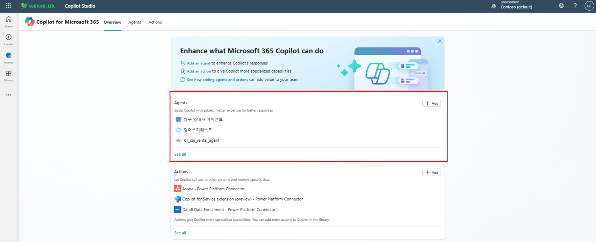
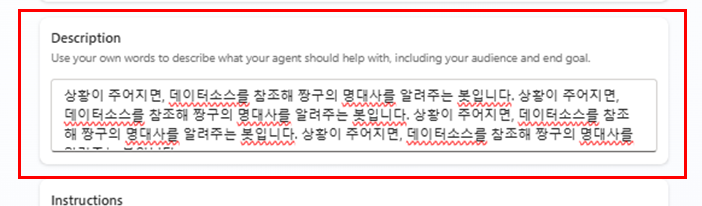
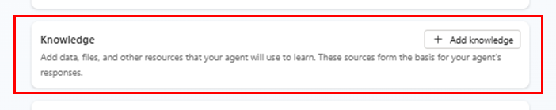

# ⚒️ 만들면서 Declarative 에이전트를 익혀보아요(1)!
{: .no_toc }

모두가 Copilot Studio에 좀 익숙해졌을 텐데요.  
이제부터는 **Declarative 에이전트를 만들면서**, 어떤 기능이 있는지, 어떻게 만들 수 있는지 익혀볼까요?!
백문이 불여일견이라고, 제 친구의 문제를 해결하는 에이전트를 만들면서 Declarative의 주요기능을 익혀봐요. 

---

## 이번 학습으로 다음과 같은 사항을 배울 수 있어요!

- ✅ Declarative 에이전트를 만드는 방법을 익혀볼거에에요.
- ✅ RAG 시스템을 활용한 챗봇을 만들면서 실습을 해보자구요.
- ✅ Declarative 에이전트의 주요 기능들을 이해해요!

---

## 우리가 Declarative 에이전트로 해결할 문제
아래 사례는 실제 제 친구의 사연을 기반으로 재구성되었습니다. 

{: .note }
대학을 갓 졸업한 자랑스러운 내 친구 변 모양.  
국내 모 기업의 반도체 영업부서에 입사했어요.  
하지만 뼛속까지 문과인 변 모양, 생소한 수천 가지 반도체 제품의  
규격과 상세 매뉴얼을 외우는 게 너무 어렵다는데…  

**Declarative 에이전트**와 함께라면 이 고민을 쉽게 해결할 수 있어요!  
왜냐하면 **Declarative 에이전트로 쉽게 RAG 시스템 기반 챗봇을 구축할 수 있기 때문**이죠.

---

## RAG 시스템이란?
{: .note }

**RAG (Retrieval-Augmented Generation) 시스템**은  
**LLM이 외부 데이터베이스에서 정보를 검색한 후, 이를 바탕으로 응답을 생성하는 방식**이에요.

일반적으로 직접 구현하려면,  
- 문서를 쪼개고  
- 벡터 데이터베이스에 저장하고  
- 검색한 후 LLM 프롬프트에 삽입하는  

등등… 여러 프레임워크를 다뤄야 하는데,  
**Copilot Studio에서는 이걸 노코드로 구현할 수 있어요!**  

---

그럼 이제부터 본격적으로 ***문서를 참조하고 해당 문서를 기반으로 답변을 제공하는 챗봇***을 만들어 봐요!

저는 짱구를 좋아하기에, 짱구 명대사가 정리된 문서를 기반으로, 짱구의 명대사를 조회하고 알려주는 에이전트를 만들어볼게요. 

여러분들은 각자의 니즈에 맞게 원하시는 문서를 참조하는 에이전트를 만들어 보시면 됩니다. 

그럼 시작해보시죠!
(지금부터의 설명은 전의 학습내용을 잘 아신다는 전제로 진행됩니다... 전 단계들을 공부하지 않으셨다면 한번 보고 와주세요😊😊)

---

# 📌 Step 1: Declarative 에이전트 생성하기

### 1. Copilot Studio에서 에이전트 만들기

1. **Copilot Studio**에 접속합니다.
2. 왼쪽 **"에이전트"** 탭으로 이동합니다.
3. **"Copilot for Microsoft 365"**를 클릭합니다.  
   → 아래와 같이 **Declarative Agents를 만들고 관리할 수 있는 화면**으로 이동하게 돼요.

### 2. 새 Declarative 에이전트 추가하기

1. **빨간색으로 표시된 "Agents" 섹션**에서  
   지금까지 만든 Declarative Agent들을 확인할 수 있어요.
2. **"Add" 버튼을 눌러** 새로운 Declarative Agent를 만들러 가보시죠죠

---

# 📌 Step 2: 에이전트 설정 (Skip Configure)

버튼을 누르면 만들면,  
**대화를 통해 Declarative Agent를 생성하는 화면**으로 이동하게 되는데요.  

하지만, 저는 **이 기능은 잘 사용하지 않아요.**  
아직 많이 불편하더라고요. 😅  

그래서 우리는 **"Skip Configure"** 버튼을 눌러  
**모델을 직접 설정하는 곳**으로 이동할 거예요!

이제 본격적으로 **문서를 참조하고, 이를 기반으로 답변하는 챗봇**을 만들어볼까요?

---

# 📌 Step 3: Declarative 에이전트 초기 설정하기

이제 본격적으로 **에이전트의 주요 기능**을 설정해볼게요!  
아래 화면을 보면 **각 섹션별로 에이전트의 기능을 지정할 수 있어요.**  
각 기능이 어떤것인지 설정하면서 알아볼까요?

## 1️⃣ 에이전트 이름 & 아이콘 설정

- **이름과 아이콘**을 설정할 수 있어요.
- 이 설정은 **유저에게도 보이는 부분**이에요!
- 나중에 수정할 수 있으니 부담 가지지 말고 설정해 주세요. 😃  

---

## 2️⃣ Description (에이전트에 대한 설명)

- **에이전트에 대한 간략한 설명**을 적어주세요.  
- **경험상**, 이 설명이 에이전트의 동작 로직에 큰 영향을 미치지는 않아요.  
- **누구를 위한 건지, 목적이 뭔지** 정도만 간략하게 적어주시면 됩니다!

> **예시**
> - "반도체 영업부서 직원을 위한 제품 정보 조회 챗봇"
> - "짱구 명대사를 기반으로 대답해주는 챗봇"

---

## 3️⃣ Instruction (에이전트의 행동 정의)

이 부분은 **아주아주아주 중요합니다!**  
Copilot 에이전트의 행동을 정의하는 곳인데요.  

**다른 AI 모델의 "시스템 프롬프트"에 해당하는 부분**이라 생각하면 됩니다.  
최대한 자세하게 정의할수록 에이전트가 원하는 대로 동작해요!

> **📌 추천하는 5가지 Instruction 요소**  
> 경험상 Copilot 에이전트는 아래 다섯 가지 요소를 포함할 때 가장 잘 동작하는 것 같아요.  

### ✏️ 1) 역할 (Role)
- 에이전트가 수행해야 하는 역할을 명확히 정의합니다.  
- **예시**:  
  - "나는 반도체 영업부서 직원을 돕는 챗봇이다."  
  - "나는 짱구 명대사를 기반으로 대답하는 챗봇이다."

### 🎯 2) 목표 (Goal)
- **모델이 최우선으로 해야 하는 목표**를 정의합니다.
- 태스크별 자세한 목표도 적지만, **최상위 목표** 위주로 적어 주세요.  
- **예시**:  
  - "사용자가 입력한 반도체 제품명을 기반으로 정확한 매뉴얼 정보를 제공해야 한다."  
  - "사용자의 질문에 맞는 짱구의 대사를 찾아서 대답해야 한다."

### 🚧 3) 제한사항 (Constraints)
- 모델이 **반드시 따라야 하는 규칙과 제한사항**을 명시합니다.
- **예시**:  
  - "매뉴얼에 없는 정보는 추측하지 않는다."
  - "짱구 명대사 외에는 대답하지 않는다."

### 🔄 4) 입출력 스타일 (Input & Output Style)
- **유저의 입력 방식**과 **에이전트의 응답 방식**을 정의합니다.
- **예시**:  
  - "사용자는 반도체 제품명을 입력할 수 있다."
  - "에이전트는 매뉴얼에서 해당 제품 정보를 찾아 출력한다."

### ⚡ 5) 액션 정의 (Action Definition)
- **특정 조건에서 실행되는 액션**을 설명합니다.
- **예시**:  
  - "사용자가 특정 제품명을 입력하면, 해당 제품의 스펙을 출력한다."
  - "사용자가 '짱구야'라고 부르면 짱구 명대사를 랜덤으로 출력한다."

---
## 4️⃣ Starter Prompt

- 유저가 코파일럿을 실행했을 때, **화면에 예시 프롬프트로 표시되는 부분입니다.**
- 유저들이 주로 사용하게 될 프롬프트를 예시로 넣어주세요!

## 5️⃣ Knowledge

- **에이전트가 참고할 문서나 파일**을 업로드하는 곳이에요.
- 이 설정을 통해 **RAG 시스템을 구축할 수 있어요!**
- **초기 설정 후에도 변경할 수 있으니**, 지금은 넘어가고 다음 학습에서 자세히 다뤄볼게요

---

## 6️⃣ Web Browsing 설정 (추가 설정)

마지막 **Additional Settings** 부분에서는 **Web Browsing 여부**를 선택할 수 있어요!  
이 설정은 **에이전트가 답변을 생성할 때 웹 데이터를 참고할지 여부**를 결정하는 기능이에요.

### 🔹 Web Browsing 활성화 시
- **에이전트는 제공받은 액션이나 자료뿐만 아니라, 웹의 최신 정보도 참고**해서 답변할 수 있어요.
- 실시간 데이터가 중요한 경우 유용합니다. (예: 뉴스, 주식 시세, 날씨 등)

### 🔹 Web Browsing 비활성화 시
- **에이전트는 업로드된 문서나 액션만을 기반으로 동작**해요.
- 기업 내부 문서나 특정 자료만 사용하고 싶을 때 적절한 설정이에요.

**위 내용을 따라 초기설정을 해주시고, create을 누르시면 에이전트**에 대한 초기 세팅이 완료됩니다. 
만일 create 버튼이 활성화 되지않는다면, 비어있는 부분이 있거나, 내용이 적절하지 않아서에요! 다시 확인해 주세요. 

아래와 같은 화면이 나오면 성공!

생각보다 내용이 길어졌네요.
다음 자료를 첨부하는 부분이나, 액션이라는 부가기능에 대한 설명은 2부로 찾아뵙겠습니다!

---

# 🏁 결론

이번 학습에서는 **Declarative 에이전트를 생성하고, 주요 설정을 구성하는 방법**을 배웠어요.  
Declarative 에이전트를 활용하면 **노코드로 RAG 시스템을 구축**할 수 있고,  
이를 통해 복잡한 정보를 쉽게 검색하고 제공하는 챗봇을 만들 수 있다는 점을 확인했어요!

특히,  
✅ **에이전트 생성 과정** (Copilot Studio에서 생성 및 설정)  
✅ **Instruction 설정** (역할, 목표, 제한사항, 입출력 스타일, 액션 정의)  
✅ **RAG 시스템을 위한 문서 참조** (에이전트가 참고할 지식 추가)  

다음 학습에서는 **RAG 시스템을 활용해 문서를 참고하는 챗봇을 만들고**,  
추가로 **Declarative 에이전트의 또 다른 기능인 액션(Action) 설정**도 알아볼 거예요!  

🔥 **다음 학습에서 만나요!** 🔥

